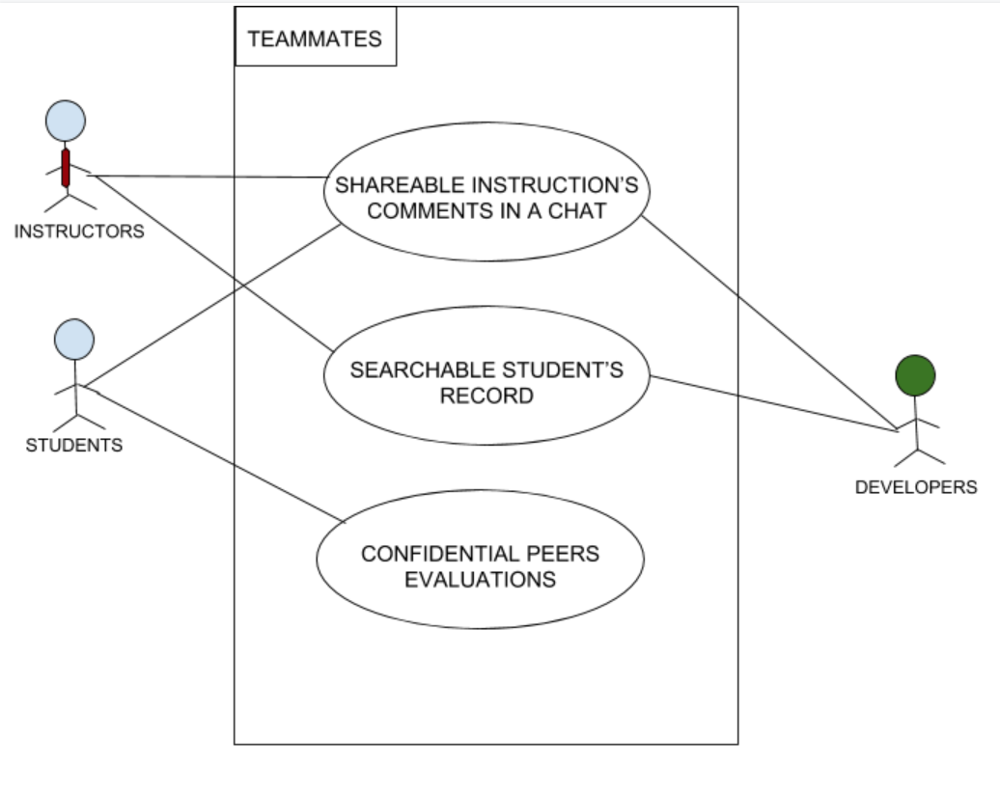
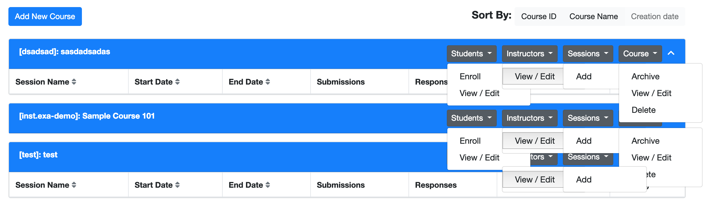

# TEAMMATES

## Project Abstract
_TEAMMATES is a free online tool for managing peer evaluations and other feedback paths of your students. It is provided as a cloud-based service for educators/students. The proposal of this project is to fix a bug on the Home Page of the website, and the issue is multiple dropdown menus stay expanded when clicked consecutively._

## Project Relevance
_This proposal is focused on Object Oriented Design and Graphic User Interface which are the concepts that forces programmers to plan out their code in order to have a better flowing program and a form of user interface that allows users to interact with electronic devices through graphical icons and visual indicators. Initially, the issue of this proposal was found on the issue tracking page of the open source which show what is wrong and what is needed to be fix. The project also required a fair amount of test driven development to solve the issues._

## Conceptual Design
_As shown in the picture below, the dropdown menu remains expanded even when other dropdown menus are expanded. I wish to fix this issue by implementing the "collapse" solution to the menu features to make the interface experience more reliable and user friendly._

## Background
_https://github.com/TEAMMATES/teammates.git_

## Required Resources
- Group members (3-4 teammates and an instructor's permission)
- Hardware and software resource required: Java and Github
